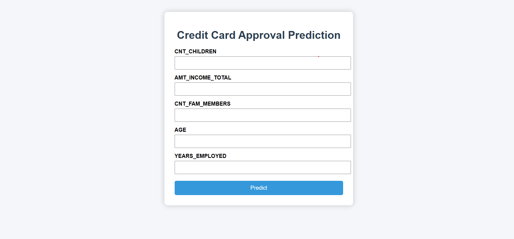
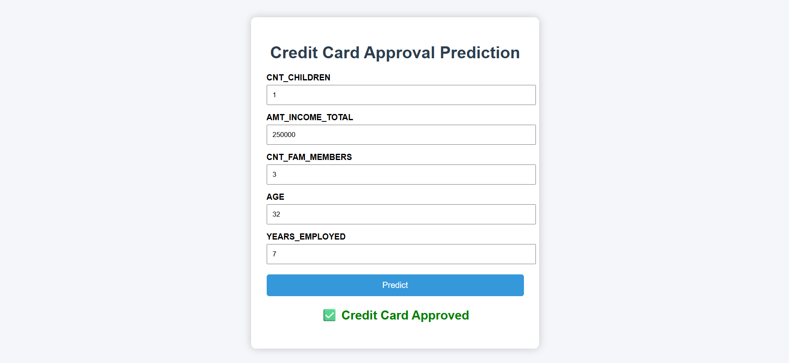

# 💳 Credit Card Approval Prediction using Machine Learning

<p align="center">


</p>

---

## 📌 Project Overview

Banks receive thousands of credit card applications every day. Evaluating every application manually is time-consuming and prone to human error.

This project automates the credit card approval process using Machine Learning. The application analyzes applicant information such as income, employment status, education, family details, housing information, and credit history to predict whether a credit card application is likely to be **Approved** or **Rejected**.

The trained Machine Learning model is integrated with a Flask web application, providing users with an easy-to-use interface for real-time predictions.

---

## 🎯 Objectives

- Automate the credit card approval process.
- Analyze applicant financial and demographic information.
- Compare multiple Machine Learning algorithms.
- Select the best-performing model.
- Deploy the model through a Flask web application.
- Provide instant prediction results.

---

# 🚀 Features

- ✅ Data Collection & Analysis
- ✅ Data Cleaning & Preprocessing
- ✅ Feature Engineering
- ✅ Multiple Machine Learning Models
- ✅ Model Performance Comparison
- ✅ Flask Web Application
- ✅ Responsive User Interface
- ✅ Real-Time Credit Card Approval Prediction

---

# 🤖 Machine Learning Models Used

The following classification algorithms were implemented and evaluated:

- Logistic Regression
- Decision Tree Classifier
- Random Forest Classifier
- XGBoost Classifier

The best-performing model was selected and integrated into the Flask application.

---

# 🛠️ Technologies Used

### Programming Language
- Python

### Machine Learning
- Scikit-learn
- XGBoost

### Data Processing
- Pandas
- NumPy

### Data Visualization
- Matplotlib
- Seaborn

### Web Framework
- Flask

### Frontend
- HTML5
- CSS3

### Development Tools
- Jupyter Notebook
- VS Code
- Git
- GitHub

---

# 📸 Application Screenshots

## 🏠 Home Page



---

## 📋 Prediction Page



---

# 📂 Project Structure

```text
Credit-Card-Approval-Prediction/
│
├── dataset/
│   └── credit_record.csv
│
├── images/
│   ├── home.png
│   └── prediction.png
│
├── models/
│   └── feature_columns.pkl
│
├── notebooks/
│   └── Credit_Card_Approval.ipynb
│
├── static/
│   └── style.css
│
├── templates/
│   ├── home.html
│   ├── index.html
│   ├── prediction.html
│   └── result.html
│
├── app.py
├── requirements.txt
├── README.md
└── .gitignore
```

---

# 📊 Dataset

The project is developed using a Credit Card Approval dataset containing applicant demographic information and historical credit records.

The original dataset contains:

- application_record.csv
- credit_record.csv

> **Note:** The original `application_record.csv` dataset and the trained model file are not included in this repository because they exceed GitHub's file size limits. They were used during model development and training.

---

# ⚙️ Installation

## 1️⃣ Clone the Repository

```bash
git clone https://github.com/sowmyaperike/Credit-Card-Approval-Prediction.git
```

---

## 2️⃣ Navigate to the Project Folder

```bash
cd Credit-Card-Approval-Prediction
```

---

## 3️⃣ Install Required Libraries

```bash
pip install -r requirements.txt
```

---

## 4️⃣ Run the Flask Application

```bash
python app.py
```

---

## 5️⃣ Open Your Browser

Visit

```
http://127.0.0.1:5000/
```

---

# 🔄 Project Workflow

```
Dataset Collection
        │
        ▼
Data Analysis
        │
        ▼
Data Cleaning
        │
        ▼
Feature Engineering
        │
        ▼
Model Training
        │
        ▼
Model Evaluation
        │
        ▼
Best Model Selection
        │
        ▼
Flask Application
        │
        ▼
Prediction Result
```

---

# 📈 Future Enhancements

- Deploy the application using Render or Railway.
- Improve prediction accuracy.
- Build REST APIs.
- Add user authentication.
- Create an admin dashboard.
- Improve UI responsiveness.
- Add model performance visualization.

---

# 👥 Team Members

| Name | Role |
|------|------|
| **Sowmya Perike** | Team Lead |
| **Pravallika Sri Modugumudi** | Team Member |
| **R N V Sai Ramya Tadepalli** | Team Member |
| **Manga Doddi Chaitanya** | Team Member |
| **Kraanthi Kunasani** | Team Member |

---

# 🎓 Academic Information

**Program:** Artificial Intelligence & Machine Learning

**Platform:** SkillWallet

**Project:** Credit Card Approval Prediction using Machine Learning

---

# 🙏 Acknowledgements

We sincerely thank our mentors, faculty members, and the SkillWallet Artificial Intelligence & Machine Learning Program for their guidance and support throughout the development of this project.

---

# 📄 License

This project was developed for educational and learning purposes.

---

# ⭐ Support

If you found this project helpful, please consider giving it a ⭐ on GitHub.

Thank you for visiting this repository!
